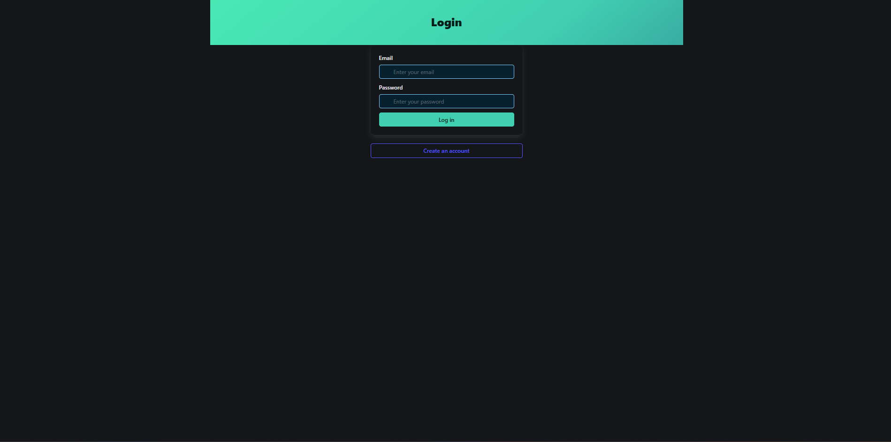
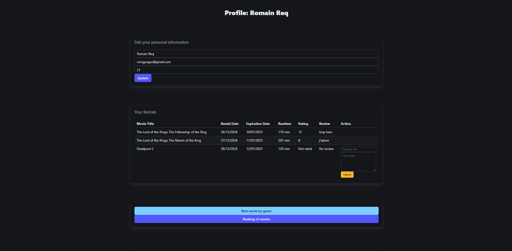
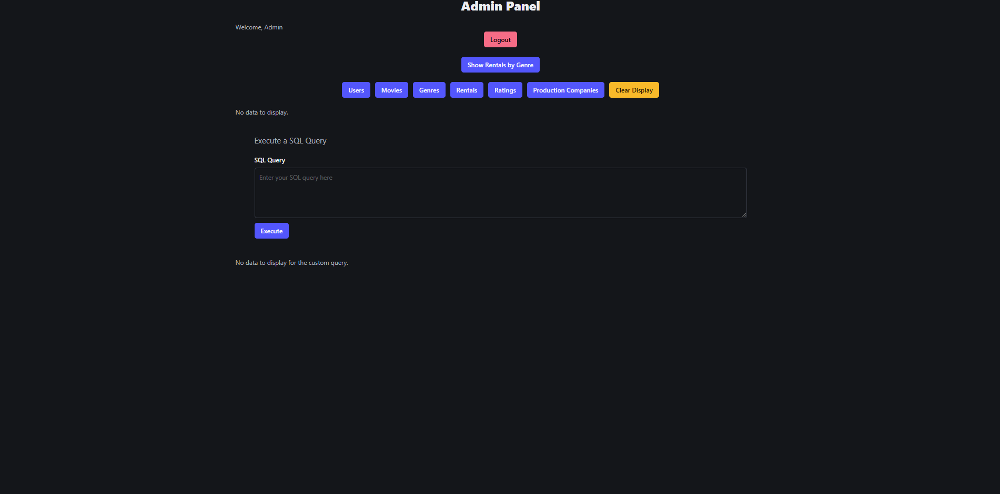

# Node and React Project
## Table of Contents

1. [Description](#description)
2. [Project Structure](#project-structure)
   - [Backend](#backend)
   - [Frontend](#frontend)
   - [imgWebsite](#imgwebsite)
   - [sqlDeveloper](#sqldeveloper)
3. [Key Features](#key-features)
   - [Admin Panel](#admin-panel)
   - [Login and Registration](#login-and-registration)
   - [User Panel](#user-panel)
4. [Prerequisites](#prerequisites)
   - [Backend](#backend-1)
   - [Frontend](#frontend-1)
5. [Database](#database)
   - [Tables](#tables)
6. [Installation and Execution](#installation-and-execution)
   - [Clone the Repository](#1-clone-the-repository)
   - [Start the Backend](#2-start-the-backend)
   - [Start the Frontend](#3-start-the-frontend)
7. [Utilisation](#utilisation)
   - [Login](#login)
   - [SignUp](#signup)
   - [UserPanel](#userpanel)
   - [AdminPanel](#adminpanel)
8. [API Documentation](#api-documentation)
9. [Video Presentation](#video-presentation)
10. [Author](#author)

----

## Description
Our Node and React project is a web application that simulates a platform for renting movies.
- Users can rent and rate movies.
- The admin has access to all the information.

## Project Structure

### Backend
The backend is built with **Node.js** and **TypeScript**, providing a REST API for database interactions.  
Main backend functionalities include:
- Executing SQL queries.
- Managing users (add, delete, update).
- A Swagger page to explore available REST APIs.

**Main files:**
- `src/index.ts`: Entry point for the backend.
- `tsconfig.json`: TypeScript configuration.
- `package.json`: Backend dependencies.

---

### Frontend
The frontend is developed with **React.js** and **TypeScript**, providing an intuitive user interface for data interaction.

**Main components:**
1. **`src/components/AdminPanel.tsx`**:
   - Displays and manages data for users, movies, genres, and rentals.
   - Executes custom SQL queries.
   - Integrates interactive charts (HighCharts)

2. **`src/components/Login.tsx`**:
   - Login page for users.

3. **`src/components/SignUp.tsx`**:
   - User registration page.

4. **`src/components/UserPanel.tsx`**:
   - User dashboard for viewing rental history.
   - Search movie 
   - Rent a movie

**Other files:**
- `src/sqlQuery.tsx`: Contains functions to execute SQL queries.
- `src/index.tsx`: React entry point.
- `src/index.css`: Stylesheet.

---
### imgWebsite
The `imgWebsite` folder contains images used for presenting the website's design and features.  
These images are present in this README file.

**Files:**
- `image.png`
- `image-1.png`
- `image-2.png`
- `image-3.png`
- `image-4.png`

---

### sqlDeveloper
The `sqlDeveloper` folder contains Oracle SQL scripts used for database functions, table creation, queries, and optimizations.

**Files:**
- `Delete.sql`: Script for deleting records.
- `drop.sql`: Script for dropping tables.
- `Function.sql`: Custom Oracle functions.
- `Insert.sql`: Script for inserting records.
- `Optimization.sql`: Optimization-related scripts.
- `Procedure.sql`: Stored procedures for various operations.
- `Query.sql`: Predefined SQL queries for the application.
- `RelationalSchemaSQL.png`: Diagram of the database schema.
- `Security.sql`: Security-related scripts for database.
- `Select.sql`: Select queries for data retrieval.
- `Table.sql`: Scripts for creating tables.
- `Trigger.sql`: SQL triggers for automating actions.
- `Update.sql`: Scripts for updating records.
- `movies_dataset_a_utiliser.csv`: Dataset used for populating the database.

---

## Key Features

### 1. Admin Panel
The admin panel enables:
- Displaying data.
- Deleting users with direct actions.
- Executing custom SQL queries.
- Visualizing statistics through HighCharts.

### 2. Login and Registration
Users can:
- Log in using an email and password.
- Register with personal details.

### 3. User Panel
The user panel enables:
- Displaying personnal information (you can change them)
- Displaying all rentals (and if not rated yet, you can put a rating and a review)
- Some display of SQL Request
- Search of movie
- Rental of a selected movie

---

## Prerequisites

### Backend
- **Node** (v14 or higher)
- **Cors**
- **express**
- **oracledb**

### Frontend
- **React**
- **Bulma.css**
- **Axios**
- **HighChart**

### Database
#### Oracle - MySQL Developer

We used a dataset with movies and informations about them, and created a database with this. 

We created tables like `Movie`, `Genre`, `Production_Company`, `Rating`, `Rental`, `Users`, `Movie_Genre` and `Movie_Production_Company`.

We limited our project to the use of only 1000 movies.

You can find all the files needed to implement the database on an app like MySQL Developer in the folder [sqlDeveloper](./sqlDeveloper/).
The information to connect to Oracle are present at the beginning of the file `index.ts` in the backend.
You need an Oracle connection for your database. And for the website, you're referencing the password, the user and the connectstring only once at the beginning of the file.

#### Tables
The Primary and foreign key were added outsite of the creation of the tables.
```sql
-- Table Movie
CREATE TABLE Movie (
    movie_id NUMBER GENERATED BY DEFAULT AS IDENTITY,
    title VARCHAR2(255),
    release_date DATE,
    runtime NUMBER,
    vote_average VARCHAR(50),
    vote_count NUMBER,
    adult VARCHAR2(100), 
    original_language VARCHAR2(150),
    overview VARCHAR2(1100),
    popularity VARCHAR(50),
    tagline VARCHAR2(255)
);
 
-- Table Genre
CREATE TABLE Genre (
    genre_id NUMBER GENERATED BY DEFAULT AS IDENTITY,
    genre_name VARCHAR2(255)
);

-- Table Movie_Genre
CREATE TABLE Movie_Genre (
    movie_id NUMBER,
    genre_id NUMBER
);

-- Table Users
CREATE TABLE Users (
    user_id NUMBER GENERATED BY DEFAULT AS IDENTITY,
    name VARCHAR2(100),
    email VARCHAR2(100),
    age NUMBER,
    role VARCHAR(50)
);

-- Table Rental
CREATE TABLE Rental (
    rental_id NUMBER GENERATED BY DEFAULT AS IDENTITY,
    user_id NUMBER,
    movie_id NUMBER,
    rental_date DATE,
    end_date GENERATED ALWAYS AS (rental_date + 15) VIRTUAL
);

-- Table Rating
CREATE TABLE Rating (
    rating_id NUMBER GENERATED BY DEFAULT AS IDENTITY,
    user_id NUMBER,
    movie_id NUMBER,
    rating_value NUMBER(4, 2),
    review VARCHAR2(1100)
);

-- Table Production_Company 
CREATE TABLE Production_Company (
    company_id NUMBER GENERATED BY DEFAULT AS IDENTITY,
    name VARCHAR2(255)
);

-- Table Movie_Production_Company 
CREATE TABLE Movie_Production_Company (
    movie_id NUMBER,
    company_id NUMBER
);
```
---

## Installation and Execution

### 1. Clone the repository
```bash
git clone https://github.com/Tailroil/Node_React_Project.git
cd Node_React_Project
```
### 2. Start the backend
```bash
cd backend
npm install cors
npm install express
npm install oracledb
npm start
```
### 3. Start the frontend
```bash
cd frontend
npm install react
npm install bulma
npm install axios
npm install highcharts highcharts-react-official
npm start
```

## Utilisation

When the site is started, at first an error will show, you can close the error with the cross on the top right. This error isn't a real one, because it's not impacting the website.

### Login
1. Connect as either a **user** or an **admin**:
    - **User**: Create your own profile or use an existing account:  
      *Email*: `adrienservas@exemple.com`  
      *Password*: `User`
    - **Admin**: Use the admin credentials:  
      *Email*: `admin@exemple.com`  
      *Password*: `admin`
2. Depending on the email and password, you will be redirected to either the `AdminPanel` or the `UserPanel`.



---
### SignUp
- Register by providing your personal information.  
- **Note**: You cannot create a user with an already registered email.  
- After successful registration, return to the `Login` page using the provided button.


---
### UserPanel
1. **Logout**: Use the log-out button to end the session.  
2. **Personal Information**: View and update your personal details. Click the update button to save changes.  
3. **Rentals**: Display all your rentals:
   - Rentals without ratings and reviews can be updated directly.
4. **Insights**:
   - Click buttons to display insights:
     - **"Best movie by genre"**  
     - **"Ranking of movies"**
5. **Search Movies**:
   - Enter a movie name in the search bar.  
   - Click on a movie to view details and decide whether to rent it.



----
### AdminPanel
1. **Logout**: Use the log-out button to end the session.  
2. **Highcharts Visualization**:
   - Display a chart showing the number of rentals by genre.  
   - Click the button again to hide the chart.
3. **Data Management**:
   - View tables by clicking buttons for:
     - `Users`
     - `Movie`
     - `Genre`
     - `Rental`
     - `Rating`
     - `Production_Company`
   - Use the "Clear Display" button to reset the view.
4. **SQL Query**: Execute custom SQL queries in the provided query section.



## API Documentation

The backend provides a Swagger OpenAPI page for testing and understanding the REST API.

### Access Swagger
Start the backend and navigate to:
- [Swagger UI](http://localhost:5000/api-docs)

## Video Presentation
- [Video](imgWebsite/Presentation_Website_Node_And_React.mp4)
You have to download the file to see the video because it's too big.

## Author
- Romain REQUENA https://github.com/Tailroil
- Raphael ROUX  https://github.com/Raphoum
- Léonard SEIDLITZ  https://github.com/TartineLibre 
